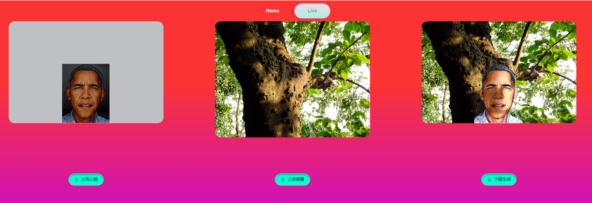

简体中文 | [English](README_EN.md)

我们基于[PaddleSeg](https://github.com/PaddlePaddle/PaddleSeg)的分割模型和[DPR](https://github.com/zhhoper/DPR)算法，实现了一个前后端交互的效果的relighting课程设计项目。

**基本目标：**

完成离线模块的核心算法部分，实现场景光照的提取，实现人像的重打光。

**拓展目标：**

完成UI客户端设计，能够通过UI与用户交互，上传图片。

服务端部分能够接收用户请求，保存图片。

服务端能够顺利调用核心图像拼接算法。

客户端、服务端、核心算法顺利联调，成功运行，无明显恶性bug

示范：

**环境配置：**

安装[PaddleSeg](https://github.com/PaddlePaddle/PaddleSeg)和[DPR](https://github.com/zhhoper/DPR)所需要的所有库函数

首先使用conda创建一个虚拟环境，已经有很多自带的安装包了，安装requirement.txt里面的库，再安装pytorch，这里根据CUDA版本例如CUDA=11.7和对应的cuDNN，使用下面两条命令安装对应的torch 和paddlepaddle（请更换对应的版本，Paddle版本与CUDA和pytorch版本需要匹配。，参考[PyTorch](https://pytorch.org/)，参考[Windows 下的 PIP 安装-使用文档-PaddlePaddle深度学习平台](https://www.paddlepaddle.org.cn/documentation/docs/zh/install/pip/windows-pip.html)），CPU版本请相应安装。（如果torch对应CUDA=11.7的版本频繁安装失败，也可使用11.8）

conda create -n Paddle python=3.9.12 

pip install -r requirements.txt

pip3 install torch torchvision torchaudio --index-url https://download.pytorch.org/whl/cu117                                

python -m pip install paddlepaddle-gpu==2.5.2.post117 -f https://www.paddlepaddle.org.cn/whl/windows/mkl/avx/stable.html  

**使用方法**：在根目录下  python manage.py runserver

或者运行video_relighting.py函数，自行选择视频和图像。

**Warning:** 如果会出现Library cublas64_12.dll is not found，请在环境的bin目录下，复制Library cublas64_11.dll重命名为Library cublas64_12.dll。原因暂不明。

声明：本项目参考了[DPR](https://github.com/zhhoper/DPR)的代码

